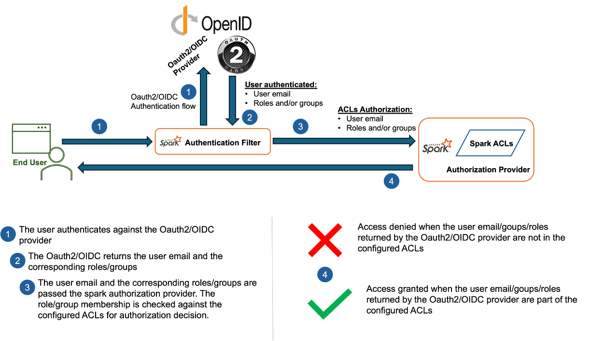
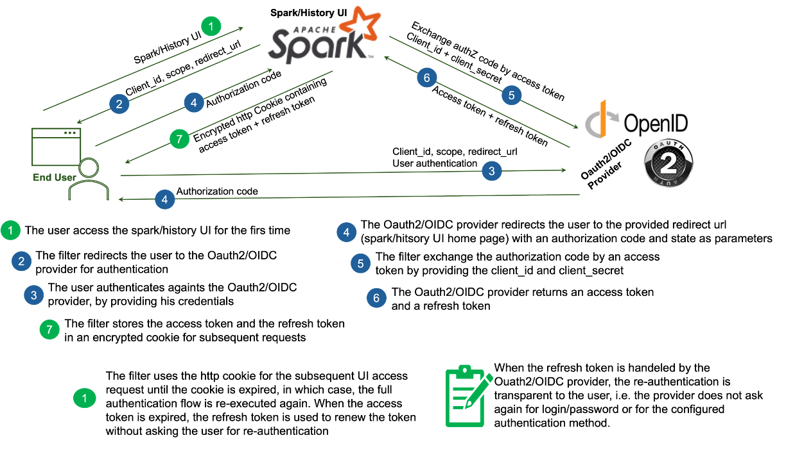

[](http://www.apache.org/licenses/LICENSE-2.0)

[Apache Spark](https://spark.apache.org/) extension filter to enable Oauth2/OpenID Connect based authentication for Spark UIs and Spark History.



The project consists of two main components:

1. `Authentication filter`: Authenticates the user against an Oauth2/OIDC provider by implementing the [Authorization Code grant flow](https://datatracker.ietf.org/doc/html/rfc6749).
   The filter supports all the providers compliant with Oauth2 and OpenID standards.
3. `Authorization provider`: An additional optional layer, on top of the `Authentication filter`, authorizes Spark UI/History UI user access 
by comparing the user email and/or groups and/or roles returned by the Oauth2/OIDC provider during the authentication phase with the configured [spark ACLs](https://spark.apache.org/docs/latest/security.html#authentication-and-authorization)

The implementation architecture of the `Authorization Code` grant flow is described by the following schema:



For more details, please check the [Authorization Code grant flow](https://datatracker.ietf.org/doc/html/rfc6749#section-4.1).

# Authorization Grant support matrix

| Authorization Grant                    | Support            | Description                                                                                                                                                                                                             |
|:---------------------------------------|--------------------|-------------------------------------------------------------------------------------------------------------------------------------------------------------------------------------------------------------------------|
| `Authorization Code`                   | :heavy_check_mark: | Confidential client - Authorization Code standard flow                                                                                                                                                                  |
| `Authorization Code + PKCE extension`  | :x:                | The [feature](#Use-cases-limitation-and-future-work) will be implemented in a separate UI portal ([See challenges/JS and Browser local cache](https://www.ietf.org/archive/id/draft-ietf-oauth-security-topics-25.html) |
| `Implicit`                             | :x:                | Deprecated                                                                                                                                                                                                              |
| `Resource Owner Password Credentials`  | :x:                | Not suitable                                                                                                                                                                                                            |
| `Client Credentials`                   | :x:                | NA                                                                                                                                                                                                                      |


# Installation

1. Using Docker

```shell
ADD https://repo1.maven.org/maven2/io/okdp/okdp-spark-auth-filter/1.0.0/okdp-spark-auth-filter-1.0.0.jar ${SPARK_HOME}/jars
```

2. Using Maven

```xml
<dependency>
  <groupId>io.okdp</groupId>
  <artifactId>okdp-spark-auth-filter</artifactId>
  <version>1.0.0</version>
</dependency>
```

3. Spark on Yarn/Standalone mode

Copy the jar https://repo1.maven.org/maven2/io/okdp/okdp-spark-auth-filter/1.0.0/okdp-spark-auth-filter-1.0.0.jar into `${SPARK_HOME}/jars/` in the different spark nodes

# Configuration

## Create an Oauth2/OIDC client

Create an Oauth2/OIDC client with an `Authorization Code grant` flow (confidential client).

Set the redirect URL to a valid spark UI or Spark History UI home page.

For [keycloak](https://www.keycloak.org/docs/latest/server_admin/#_oidc_clients), 
* Access Type: `Confidential`
* Standard Flow Enabled: `Enabled`
* Implicit Flow Enabled: `Disabled`
* Direct Access Grants Enabled: `Disabled`

Once done, save the `client_id` and `client_secret` into your secret management vault.

## Configure the authentication filter

The filter relies on the spark [spark.ui.filters](https://spark.apache.org/docs/latest/configuration.html) configuration property.

| Property                     | Equivalent env variable        | Default | Description                                                                                                                                            |
|:-----------------------------|--------------------------------|:-------:|--------------------------------------------------------------------------------------------------------------------------------------------------------|
| `issuer-uri`                 | `AUTH_ISSUER_URI`              |    -    | OIDC Provider issuer URL</br>This is used to discover OIDC endpoints                                                                                   |
| `client-id`                  | `AUTH_CLIENT_ID`               |    -    | The Oauth2/OIDC client Id                                                                                                                              |
| `client-secret`              | `AUTH_CLIENT_SECRET`           |    -    | The Oauth2/OIDC client secret                                                                                                                          |
| `redirect-uri`               | `AUTH_REDIRECT_URI`            |    -    | Spark UI/History home page</br>ex.: https://spark-history.example.com/home                                                                             |
| `scope`                      | `AUTH_SCOPE`                   |    -    | The scope(s) requested the Authorization Request.</br>Example: `openid+profile+email+roles+offline_access`                                             |
| `cookie-max-age-minutes`     | `AUTH_COOKE_MAX_AGE_MINUTES`   | 12 * 60 | The maximum spark-cookie cookie duration in minutes                                                                                                    |
| `cookie-cipher-secret-key`   | `AUTH_COOKIE_ENCRYPTION_KEY`   |    -    | Cookie encryption key</br> Can be generated using: `openssl enc -aes-128-cbc -k <PASS PHRASE> -P -md sha1 -pbkdf2`                                     |
| `cookie-is-secure`           | `AUTH_COOKE_IS_SECURE`         |  true   | When enabled, the cookie is transmitted over a secure connection only (HTTPS).</br> Disable the option if your run with a non secure connection (HTTP) |

> [!NOTE]
> 1. `issuer-uri` property or `AUTH_ISSUER_URI` env variable
>    
>     Try to access the endpoint `<issuer-uri>/.well-known/openid-configuration` (public access) to check if the `issuer-uri` is valid. 
> 
>     This should return the different authentication endpoints (authorization, access token, user info endpoints, supported scopes etc.).
> 
>     For keycloack, the default `issuer-uri` is at `https://<keycloak.example.com>/auth/realms/master/` and `https://<keycloak.example.com>/auth/realms/master/.well-known/openid-configuration` is the well known configuration endpoint.
> 
> 2. `cookie-cipher-secret-key` property or `AUTH_COOKIE_ENCRYPTION_KEY` env variable
> 
>    Generate the cookie encryption key by issuing the command:
>
>    ```shell 
>    openssl enc -aes-128-cbc -k <YOUR_PASS_PHRASE> -P -md sha1 -pbkdf2
>    ```
>    
> 3. `scope` property or `AUTH_SCOPE` env variable
> 
>    The minimum required scope to turn on authentication is: `openid+profile+email`
>
>    Add offline scope `offline_access` to enable the refresh token
>
>    Add the `roles` and/or `groups` scope to enable role/groups based authorization
>
>    It is not necessary to add groups and/or roles `scope` if you only need the authentication, and you don't need the authorization.
>
>    N.B.: Please, note that the `groups` scope is not supported by the most OIDC providers. You can check the supported scopes at `<issuer-uri>/.well-known/openid-configuration` url.
> 
>    N.B.: Keycloack supports returning the groups for a user by adding `Group Membership mapper` to your client
> 
> 4. `cookie-is-secure` property or `AUTH_COOKE_IS_SECURE` env variable
> 
>     It's recommended to secure the connection to your spark UIs by enabling HTTPS. Although, the spark cookie is encrypted, it's recommended to send it over an encrypted connection.
> 
>     By default, the property is enabled. Disable the property if your connection is not secure otherwise the cookie will not be sent
> 

### Basic configuration

The filter can be enabled either by setting the properties globally in the `spark-defaults.properties`

```properties
spark.ui.filters=io.okdp.spark.authc.OidcAuthFilter
spark.io.okdp.spark.authc.OidcAuthFilter.param.issuer-uri=<issuer-uri>
spark.io.okdp.spark.authc.OidcAuthFilter.param.client-id=<client-id>
spark.io.okdp.spark.authc.OidcAuthFilter.param.client-secret=<client-secret>
spark.io.okdp.spark.authc.OidcAuthFilter.param.redirect-uri=<redirect-uri>
spark.io.okdp.spark.authc.OidcAuthFilter.param.scope=<scope>
spark.io.okdp.spark.authc.OidcAuthFilter.param.cookie-max-age-minutes=480
spark.io.okdp.spark.authc.OidcAuthFilter.param.cookie-cipher-secret-key=<cookie-cipher-secret-key>
spark.io.okdp.spark.authc.OidcAuthFilter.param.cookie-is-secure=<true|false>
```

Or during the job submission like the following:

```shell
spark-submit  --conf spark.ui.filters=io.okdp.spark.authc.OidcAuthFilter \
--conf spark.io.okdp.spark.authc.OidcAuthFilter.param.issuer-uri=<issuer-uri> \
--conf spark.io.okdp.spark.authc.OidcAuthFilter.param.client-id=<client-id>         \
--conf spark.io.okdp.spark.authc.OidcAuthFilter.param.client-secret=<client-secret> \
--conf spark.io.okdp.spark.authc.OidcAuthFilter.param.redirect-uri=<redirect-uri>   \
--conf spark.io.okdp.spark.authc.OidcAuthFilter.param.scope=<scope>                 \
--conf spark.io.okdp.spark.authc.OidcAuthFilter.param.cookie-max-age-minutes=480    \
--conf spark.io.okdp.spark.authc.OidcAuthFilter.param.cookie-cipher-secret-key=<cookie-cipher-secret-key> \
--conf spark.io.okdp.spark.authc.OidcAuthFilter.param.cookie-is-secure=<true|false>  \
--class ...
```

### Kubernetes configuration

The properties can also be passed by their equivalent env variables. 

You can save the client_id, client secret and the cookie encryption key in a kubernetes secret and reference it as an env variable like the following:

```yaml
env:
- name: AUTH_ISSUER_URI
  value: <issuer-uri>
- name: AUTH_CLIENT_ID
  valueFrom:
  secretKeyRef:
- name: AUTH_REDIRECT_URI
  value: <redirect-uri>
- name: AUTH_SCOPE
  value: openid+profile+email+roles+offline_access
- name: AUTH_CLIENT_SECRET
  valueFrom:
  secretKeyRef:
- name: AUTH_COOKIE_ENCRYPTION_KEY
  valueFrom:
  secretKeyRef:
```


## Configure the authorization provider (optional)
### Overview

An example of a raw access token returned by the Oauth2/OIDC provider during a successful authentication is like the following:

```json
{
   "access_token": "eyJhbGciOiJI6-auxZsE6...",
   "token_type": "bearer",
   "expires_in": 86399,
   "refresh_token": "ChlvaWJmNXBuaG1rdWN0e...",
   "id_token": "eyJhbGciOiJSUzI1NiIsImtpZCI6IjBkZWEw..."
}
```

The token payload after [decoding](https://jwt.io/) the `access_token` is as follows:

```json
{
   "iss": "<issuer-uri>",
   "sub": "CgNib2ISBGxkYXA",
   "aud": "<client-id>",
   "exp": 1708476719,
   "iat": 1708390319,
   "at_hash": "x_kKHrjGfnSfkjDwIGPPbg",
   "email": "bob@example.org",
   "email_verified": true,
   "groups": ["admins", "team1", "/team2"],
   "roles": ["role-team1", "admin-role"],
   "name": "bob"
}
```

The `"email"`, `"groups"` and/or `"roles"` can be mapped in Spark ACLs to consequently grant or denies access.

### Configuration

A basic configuration properties to enable the provider globally, in `spark-defaults.conf`, are:

```properties
spark.user.groups.mapping=io.okdp.spark.authz.OidcGroupMappingServiceProvider
spark.acls.enable=true
spark.history.ui.acls.enable=true
# Comma separated list of admin groups (view all applications)
spark.history.ui.admin.acls.groups=admins,team1
```

These properties should be set before the spark history starts.

You can also decide globally which users, roles and/or groups you grant access to your applications individually in spark history UI 
or your spark ui by adding the properties in `spark-defaults.conf`:

Select the properties to enable the authorization for:

```properties
#Comma separated list of groups
spark.admin.acls.groups=admins,admin-role
spark.modify.acls.groups=team1
spark.ui.view.acls.groups=/team2,role-team1

# Comma separated list of users
spark.admin.acls=bob@example.org
spark.modify.acls=bob@example.org
spark.ui.view.acls=bob@example.org,bill@example.org
```

Or at spark job submission time (select the properties to enable):

```shell
spark-submit -conf spark.admin.acls.groups=admins,admin-role \
--conf spark.modify.acls.groups=team1 \
--conf spark.ui.view.acls.groups=/team2,role-team1 \
--conf spark.admin.acls=bob@example.org \
--conf spark.modify.acls=bob@example.org \
--conf spark.ui.view.acls=bob@example.org,bill@example.org \
  ...
```

# Use cases, limitation and future work

The filter is designed to address a basic use cases where you don't need to deploy extra components in order to secure your Spark UIs or Spark History.

In real world kubernetes integration, each spark application submission creates its own ingress endpoint. With hundreds of running spark applications, it becomes very difficult to track all the endpoints and configure them.

Another limitation, is that depending on the oidc provider, the number of redirect URIs per oidc client can be limited and the usage of URIs pattern can also be [prohibited](https://www.ietf.org/archive/id/draft-ietf-oauth-security-topics-25.html). 

A new central portal UI is under development to support more authorization grants (PKCE), simplify dynamic discovery, log/monitoring tracking and provides shortcuts to easily navigate and filter the spark applications.


