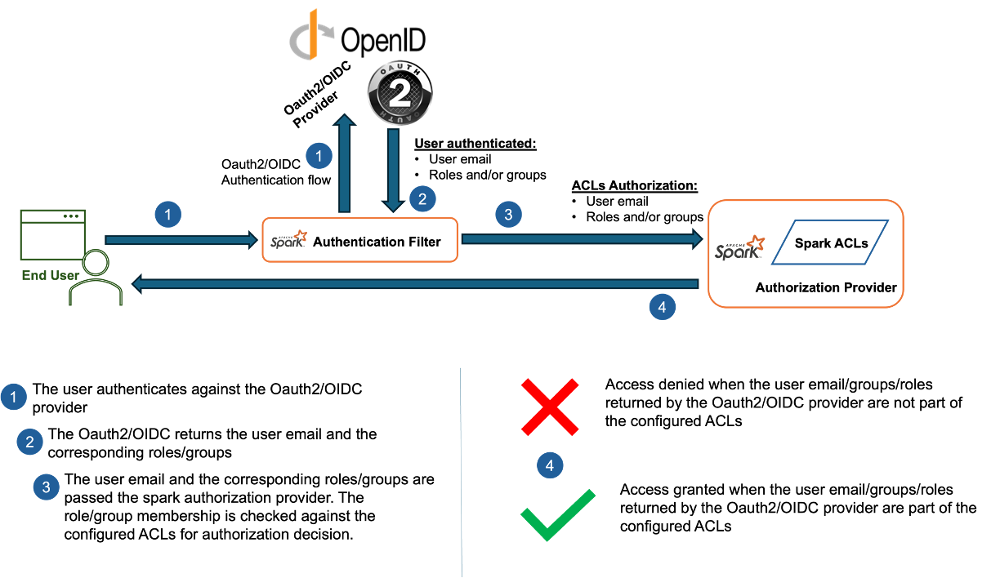

<p align="center">
  <a href="https://okdp.io">
    
  </a>
</p>

[](https://github.com/OKDP/okdp-spark-auth-filter/actions/workflows/ci.yml)
[](https://github.com/OKDP/okdp-spark-auth-filter/actions/workflows/release-please.yml)
[](https://github.com/OKDP/okdp-spark-auth-filter/releases/latest)
[](https://central.sonatype.com/artifact/io.okdp/okdp-spark-auth-filter)
[](https://spark.apache.org/)
[](https://adoptium.net/)
[](http://www.apache.org/licenses/LICENSE-2.0)

# OKDP Spark Auth Filter

OAuth2/OpenID Connect authentication and authorization for **Apache Spark** Web UIs and the Spark History Server. It is a lightweight Java servlet filter you drop into the Spark classpath: it authenticates users against any standard OAuth2/OIDC provider using the Authorization Code flow (with PKCE), and optionally maps their email, groups and roles onto native Spark ACLs, without deploying any extra component in front of Spark.

## Why this project

Apache Spark Web UIs and the Spark History Server expose detailed information about jobs, environment and logs, but their built-in access control is limited: Spark provides the servlet-filter hook (`spark.ui.filters`) and the ACL settings, but ships no ready-to-use OAuth2/OIDC filter. Securing the UIs therefore usually means writing a custom filter or putting a separate reverse-proxy / identity-aware proxy in front of every UI.

As part of the [OKDP](https://okdp.io) (Open Kubernetes Data Platform) ecosystem, this project fills that gap by providing:

- A turnkey OAuth2/OIDC authentication filter that works with any standard-compliant provider, with no additional infrastructure to deploy.
- An optional authorization layer that translates the identity claims returned by the provider (email, groups, roles) into the native Spark ACLs Spark already understands, so existing `spark.*.acls*` settings keep working.

## What the project does

- Intercepts requests to the Spark UI / History UI and runs the OAuth2/OIDC Authorization Code flow when a request is unauthenticated.
- Supports both confidential clients (with a client secret) and public clients (PKCE), auto-detecting PKCE support from the provider's well-known configuration.
- Persists the session in an encrypted, compressed HTTP cookie, so no server-side session store is required (suitable for highly available, multi-replica History Servers).
- Optionally accepts a pre-issued JWT passed in a configurable HTTP header, validated against the provider's JWKS.
- Optionally enforces authorization by mapping the user's groups/roles onto Spark view/modify/admin ACLs.

### Supported OAuth2 authorization grants

| Authorization Grant                   |      Support       | Notes                                                                                                            |
|:--------------------------------------|:------------------:|:-----------------------------------------------------------------------------------------------------------------|
| `Authorization Code`                  | :heavy_check_mark: | Confidential clients (server-side apps): [RFC 6749 §4.1](https://datatracker.ietf.org/doc/html/rfc6749#section-4.1). |
| `Authorization Code + PKCE`           | :heavy_check_mark: | Confidential clients: [OAuth 2.1](https://oauth.net/2.1/) recommendation.                                       |
| `Authorization Code + PKCE`           | :heavy_check_mark: | Public clients (SPAs / native apps): [RFC 7636](https://datatracker.ietf.org/doc/html/rfc7636).                |
| `Implicit`                            |        N/A         | Deprecated, replaced by Authorization Code + PKCE.                                                               |
| `Resource Owner Password Credentials` |        N/A         | Not suitable for this use case.                                                                                  |
| `Client Credentials`                  |        N/A         | Not suitable for this use case (no end user).                                                                   |

## Architecture

The diagram below shows the request path through the filter: the end user is authenticated against the OAuth2/OIDC provider, the provider returns the user's email and roles/groups, and, when the authorization provider is enabled, Spark grants or denies access by matching those claims against the configured ACLs.

<p align="center">
  
</p>

**Components in the flow:**

- **End user (browser)**: requests a Spark UI or Spark History Server page.
- **Authentication filter** (`OidcAuthFilter`): intercepts unauthenticated requests, runs the OAuth2/OIDC Authorization Code flow, and stores the resulting session in an encrypted, compressed cookie (`OKDP_AUTH_SPARK_UI`) so no server-side session store is needed.
- **OAuth2/OIDC provider**: authenticates the user and returns the email and the roles/groups claims; its `/.well-known/openid-configuration` is used to discover the endpoints and the JWKS.
- **Authorization provider / Spark ACLs** (`OidcGroupMappingServiceProvider`): when enabled, the user's email/groups/roles are checked against the configured Spark ACLs to grant or deny access.

Step by step:

1. The user authenticates against the OAuth2/OIDC provider.
2. The provider returns the user email and the corresponding roles/groups.
3. The email and roles/groups are passed to the Spark authorization provider and checked against the configured ACLs.
4. Access is **granted** when the email/groups/roles match the configured ACLs, and **denied** otherwise.

The filter only relies on standard Spark extension points, the servlet filter chain ([`spark.ui.filters`](https://spark.apache.org/docs/latest/configuration.html)) and the group mapping / ACL mechanism described in the [Spark Security documentation](https://spark.apache.org/docs/latest/security.html#authentication-and-authorization), so it stays decoupled from any specific Spark version.

## Requirements

- **Apache Spark** 3.1.1+ (use the default jar) or Spark 4.x (use the `jakarta` jar).
- **Java** 8 or later on the Spark runtime.
- An **OAuth2/OIDC provider** exposing a standard `/.well-known/openid-configuration` endpoint.

Known-good baseline: the default jar validated on Spark 3.5.6 (Scala 2.12, Java 17) and the `jakarta` jar on Spark 4.1.0-preview1 (Scala 2.13, Java 17), against Keycloak 26.0. This is the version set exercised by the local end-to-end setup.

### Toolchain tested

| Tool                | Version                                       |
|---------------------|-----------------------------------------------|
| Java (build & test) | JDK 11 (CI); compiled to Java 8 bytecode      |
| Maven               | 3.x                                           |
| Spark               | 3.5.6 (default jar) / 4.1.0-preview1 (jakarta) |
| Keycloak            | 26.0 (local OIDC provider)                    |

## Quick Start

1. Add the filter jar to your Spark distribution (`${SPARK_HOME}/jars`). For Spark 3.x:

   ```shell
   ADD https://repo1.maven.org/maven2/io/okdp/okdp-spark-auth-filter/1.4.3/okdp-spark-auth-filter-1.4.3.jar ${SPARK_HOME}/jars
   ```

2. Enable the filter in `spark-defaults.conf` (minimal authentication-only setup):

   ```properties
   spark.ui.filters=io.okdp.spark.authc.OidcAuthFilter
   spark.io.okdp.spark.authc.OidcAuthFilter.param.issuer-uri=<issuer-uri>
   spark.io.okdp.spark.authc.OidcAuthFilter.param.client-id=<client-id>
   spark.io.okdp.spark.authc.OidcAuthFilter.param.client-secret=<client-secret>
   spark.io.okdp.spark.authc.OidcAuthFilter.param.redirect-uri=<spark-ui-home-url>
   spark.io.okdp.spark.authc.OidcAuthFilter.param.scope=openid+profile+email
   spark.io.okdp.spark.authc.OidcAuthFilter.param.cookie-cipher-secret-key=<encryption-key>
   ```

3. Start the Spark History Server (or your Spark application) and open its UI.

### Expected result

Opening the UI redirects you to your provider's login page. After a successful login you are redirected back to the Spark UI and your session is kept in the encrypted `OKDP_AUTH_SPARK_UI` cookie until it expires.

See [Configuration](#configuration) for the full parameter reference and for enabling group/role-based authorization.

## Installation

Releases are published to [Maven Central](https://central.sonatype.com/artifact/io.okdp/okdp-spark-auth-filter/versions). Check the [latest release notes](https://github.com/OKDP/okdp-spark-auth-filter/releases/latest) for the current version. Two artifacts are published per release:

- The **default** jar for Spark 3.x (`javax.servlet`).
- The **`jakarta`**-classified jar for Spark 4+ (`jakarta.servlet`).

### Using Docker

```dockerfile
# Spark 3.x (default jar)
ADD https://repo1.maven.org/maven2/io/okdp/okdp-spark-auth-filter/1.4.3/okdp-spark-auth-filter-1.4.3.jar ${SPARK_HOME}/jars

# Spark 4+ (jakarta jar)
ADD https://repo1.maven.org/maven2/io/okdp/okdp-spark-auth-filter/1.4.3/okdp-spark-auth-filter-1.4.3-jakarta.jar ${SPARK_HOME}/jars
```

### Using Maven

```xml
<dependency>
  <groupId>io.okdp</groupId>
  <artifactId>okdp-spark-auth-filter</artifactId>
  <version>1.4.3</version>
  <!-- Spark 4+: uncomment to use the jakarta classifier -->
  <!-- <classifier>jakarta</classifier> -->
</dependency>
```

### Spark on YARN / Standalone

Copy the jar into `${SPARK_HOME}/jars/` on every Spark node:

- Spark 3.x: `okdp-spark-auth-filter-1.4.3.jar`
- Spark 4+: `okdp-spark-auth-filter-1.4.3-jakarta.jar`

(both downloadable from `https://repo1.maven.org/maven2/io/okdp/okdp-spark-auth-filter/1.4.3/`).

### Cleanup

To remove the filter, delete the jar from `${SPARK_HOME}/jars/` on every node (or rebuild your image without the `ADD` line), remove the `spark.ui.filters`, `spark.user.groups.mapping` and related `spark.io.okdp.spark.authc.*` / ACL properties from your Spark configuration, then restart Spark.

## Configuration

The filter is configured through the [`spark.ui.filters`](https://spark.apache.org/docs/latest/configuration.html) parameters (or their equivalent environment variables, convenient for Kubernetes secrets). Each property is set as `spark.io.okdp.spark.authc.OidcAuthFilter.param.<property>`.

### Create an OAuth2/OIDC client

Create a client using the **Authorization Code** grant flow and set its redirect URL to a valid Spark UI / History UI home page. With [Keycloak](https://www.keycloak.org/docs/latest/server_admin/#_oidc_clients), enable *Standard Flow* and disable *Implicit Flow* and *Direct Access Grants*; use *Confidential* access type for confidential clients (save the `client_secret` in your secret store) or *Public* for public clients. The minimum scope to enable authentication is `openid+profile+email`; add `offline_access` for refresh tokens and `roles`/`groups` for authorization.

### Parameters

The parameters most commonly customised are listed below; items marked _(required)_ have no default. The full reference is in the collapsible table that follows.

| Property                   | Env variable                 |  Default  | Description                                                                                       |
|:---------------------------|:-----------------------------|:---------:|:--------------------------------------------------------------------------------------------------|
| `issuer-uri`               | `AUTH_ISSUER_URI`            | _(required)_ | OIDC provider issuer URL, used to discover the endpoints via `/.well-known/openid-configuration`. |
| `client-id`                | `AUTH_CLIENT_ID`             | _(required)_ | OAuth2/OIDC client id.                                                                            |
| `client-secret`            | `AUTH_CLIENT_SECRET`         |     -     | Client secret. Required for confidential clients, omitted for public (PKCE) clients.              |
| `redirect-uri`             | `AUTH_REDIRECT_URI`          | _(required)_ | Spark UI / History home page, e.g. `https://spark-history.example.com/home`.                      |
| `scope`                    | `AUTH_SCOPE`                 | _(required)_ | Requested scopes, e.g. `openid+profile+email+roles+offline_access`.                               |
| `cookie-cipher-secret-key` | `AUTH_COOKIE_ENCRYPTION_KEY` | _(required)_ | Key used to encrypt the session cookie. Generate with `openssl enc -aes-128-cbc -k <PASS PHRASE> -P -md sha1 -pbkdf2`. |
| `cookie-is-secure`         | `AUTH_COOKE_IS_SECURE`       |  `true`   | Send the cookie over HTTPS only. Set to `false` for plain HTTP setups, otherwise the cookie is dropped. |
| `use-pkce`                 | `AUTH_USE_PKCE`              |  `auto`   | `auto` detects PKCE support from the provider; `true`/`false` force it.                           |
| `user-id`                  | `AUTH_USER_ID`               |  `email`  | Identity claim mapped to Spark ACLs: `email`, `sub` or `google`.                                  |

<details>
<summary><b>Full parameter reference</b></summary>

| Property                   | Env variable                 |                  Default                   | Description                                                                                                                                                                                            |
|:---------------------------|:-----------------------------|:------------------------------------------:|:------------------------------------------------------------------------------------------------------------------------------------------------------------------------------------------------------|
| `issuer-uri`               | `AUTH_ISSUER_URI`            |                _(required)_                | OIDC provider issuer URL, used to discover the OIDC endpoints.                                                                                                                                          |
| `client-id`                | `AUTH_CLIENT_ID`             |                _(required)_                | The OAuth2/OIDC client id.                                                                                                                                                                             |
| `client-secret`            | `AUTH_CLIENT_SECRET`         |                     -                      | The OAuth2/OIDC client secret. Mandatory for confidential clients, optional for public clients.                                                                                                        |
| `redirect-uri`             | `AUTH_REDIRECT_URI`          |                _(required)_                | Spark UI / History home page, e.g. `https://spark-history.example.com/home`.                                                                                                                           |
| `scope`                    | `AUTH_SCOPE`                 |                _(required)_                | The scope(s) requested by the authorization request, e.g. `openid+profile+email+roles+offline_access`.                                                                                                 |
| `use-pkce`                 | `AUTH_USE_PKCE`              |                   `auto`                   | `true`: force PKCE (provider must support it); `false`: disable PKCE for confidential clients; `auto`: detect provider support and use it, otherwise fall back to the standard Authorization Code flow. |
| `use-id-token`             | `AUTH_USE_IDTOKEN`           |                  `false`                   | `false`: read claims from the access token; `true`: read claims from the id token.                                                                                                                     |
| `cookie-max-age-minutes`   | `AUTH_COOKE_MAX_AGE_MINUTES` |                `720` (12h)                 | Maximum session cookie duration, in minutes.                                                                                                                                                           |
| `cookie-cipher-secret-key` | `AUTH_COOKIE_ENCRYPTION_KEY` |                _(required)_                | Cookie encryption key. Generate with `openssl enc -aes-128-cbc -k <PASS PHRASE> -P -md sha1 -pbkdf2`.                                                                                                   |
| `cookie-is-secure`         | `AUTH_COOKE_IS_SECURE`       |                  `true`                    | Transmit the cookie over HTTPS only. Disable for non-secure (HTTP) connections, otherwise the cookie is not sent.                                                                                       |
| `user-id`                  | `AUTH_USER_ID`               |                  `email`                   | Identity used by Spark ACLs: `email` (from the token), `sub` (from the token), or `google` (sub with the `account.google.com:` prefix removed).                                                         |
| `jwt-header`               | `JWT_HEADER`                 |                `jwt_token`                 | Header that may carry a pre-issued JWT. If absent, the default redirect-based login flow is used.                                                                                                       |
| `jwt-header-signing-alg`   | `JWT_HEADER_SIGNING_ALG`     |               `RS256, ES256`               | Signature algorithm(s) accepted when verifying the JWT header.                                                                                                                                          |
| `jwt-header-issuer`        | `JWT_HEADER_ISSUER`          |  issuer from the well-known configuration  | Override the expected issuer for the JWT header.                                                                                                                                                       |
| `jwt-header-jwks-uri`      | `JWT_HEADER_JWKS_URI`        | JWKS URI from the well-known configuration | JWKS URI used to verify the JWT header signature.                                                                                                                                                      |
| `jwt-extra-group-claim`    | `JWT_EXTRA_GROUP_CLAIM`      |                     -                      | Additional string-array claim to merge into the user's groups.                                                                                                                                         |
| `ignore-refresh-token`     | `IGNORE_REFRESH_TOKEN`       |                  `false`                   | `true`: do not store the refresh token in the cookie (avoids exceeding the cookie size limit); `false`: store it.                                                                                       |

</details>

### Enabling authorization (optional)

To authorize access based on the provider's `email`, `groups` and `roles` claims, register the group mapping provider and enable Spark ACLs in `spark-defaults.conf`:

```properties
spark.user.groups.mapping=io.okdp.spark.authz.OidcGroupMappingServiceProvider
spark.acls.enable=true
spark.history.ui.acls.enable=true
# Comma-separated list of admin groups (can view all applications)
spark.history.ui.admin.acls.groups=admins,team1
```

You can then grant access per user, group or role through the standard Spark ACL properties (`spark.admin.acls`, `spark.modify.acls`, `spark.ui.view.acls` and their `.groups` variants). These must be set before the History Server starts.

### Kubernetes

Every property has an environment-variable equivalent (see the tables above), so the client id, client secret and encryption key can be sourced from a Kubernetes `Secret` and injected as environment variables, for example `AUTH_ISSUER_URI`, `AUTH_CLIENT_ID`, `AUTH_CLIENT_SECRET`, `AUTH_REDIRECT_URI`, `AUTH_SCOPE` and `AUTH_COOKIE_ENCRYPTION_KEY`.

## Components

The project is made of two independent pieces. You can use the authentication filter alone, or add the authorization provider on top of it.

| Component | Spark configuration | Description |
|---|---|---|
| **Authentication filter**: `io.okdp.spark.authc.OidcAuthFilter` | `spark.ui.filters` | Authenticates users against the OAuth2/OIDC provider with the Authorization Code grant flow, and persists the session in an encrypted cookie. |
| **Authorization provider** _(optional)_: `io.okdp.spark.authz.OidcGroupMappingServiceProvider` | `spark.user.groups.mapping` | Authorizes access by matching the email/groups/roles returned by the provider against the configured [Spark ACLs](https://spark.apache.org/docs/latest/security.html#authentication-and-authorization). |

## OKDP Integration

This filter is the authentication and authorization layer for Apache Spark Web UIs in the [OKDP](https://okdp.io) (Open Kubernetes Data Platform) ecosystem. It secures the OKDP Spark History Server and integrates with OKDP spark-web-proxy, which exposes running Spark application UIs alongside the History Server.

## Troubleshooting

| Symptom                                                                                                 | Likely cause and fix                                                                                                                                            |
|:--------------------------------------------------------------------------------------------------------|:----------------------------------------------------------------------------------------------------------------------------------------------------------------|
| Login succeeds but you are immediately logged out / no session                                          | `cookie-is-secure=true` while serving over plain HTTP: the browser drops the cookie. Set `cookie-is-secure=false` for non-HTTPS setups.                         |
| `NoClassDefFoundError` / `ClassNotFoundException` on `javax.servlet` or `jakarta.servlet` under Spark 4 | Wrong artifact for your Spark version. Use the `-jakarta` jar for Spark 4+, the default jar for Spark 3.x.                                                       |
| Forced re-authentication after a config change                                                          | The `cookie-cipher-secret-key` changed (or differs between nodes). Use the same key on every node; old cookies can no longer be decrypted and trigger re-login. |
| Cookie too large / request rejected by the server                                                       | The refresh token inflates the cookie beyond the ~4KB limit. Set `ignore-refresh-token=true`.                                                                   |
| Groups/roles not enforced                                                                               | The `groups`/`roles` scope is missing or unsupported by the provider. Check the scopes listed at `<issuer-uri>/.well-known/openid-configuration`.               |
| Filter fails to start / cannot discover endpoints                                                       | Invalid `issuer-uri`. Verify that `<issuer-uri>/.well-known/openid-configuration` is publicly reachable and returns the OIDC endpoints.                          |

## Build

The project builds with Maven and JDK 11. A single `package` produces both the default jar (Spark 3.x) and the `jakarta`-classified jar (Spark 4+):

```shell
mvn clean package
```

Code style is enforced with [Spotless](https://github.com/diffplug/spotless) (Google Java Format); apply it before committing:

```shell
mvn spotless:apply
```

## Test

Run the unit tests:

```shell
mvn -ntp test
```

### End-to-end testing with Docker Compose

A local setup with Keycloak and a Spark History Server is provided. First, add the following entry to your `/etc/hosts`:

```
127.0.0.1       keycloak
```

Then build and run, for Spark 3.x:

```shell
mvn clean package
docker-compose up --build
```

For Spark 4+:

```shell
mvn clean package
PROFILE=Jakarta docker-compose up --build
```

Browse to http://localhost:18080/ and log in with one of the seeded users:

| User  | Password | Group      |
|-------|----------|------------|
| dev1  | user     | developers |
| dev2  | user     | developers |
| view1 | user     | viewers    |
| adm1  | user     | admins     |

The filter relies on a local cookie, so remove both the `OKDP_AUTH_SPARK_UI` cookie and the Keycloak cookie from your browser between logins. For more details see [docker-compose.yml](docker-compose.yml), [.env](.env) and the [.local](.local) setup.

Clean up the Docker Compose resources when done:

```shell
docker-compose rm -f
```

## Alternatives

Other approaches to securing the Spark UIs, and when each is a better fit:

| Alternative | When to consider it |
|---|---|
| Custom `spark.ui.filters` servlet filter (e.g. Hadoop's Kerberos/SPNEGO `AuthenticationFilter`) | You are in a Kerberos environment, or you already maintain a custom filter and don't need OAuth2/OIDC. |
| Identity-aware reverse proxy ([oauth2-proxy](https://github.com/oauth2-proxy/oauth2-proxy), [Pomerium](https://www.pomerium.com/), ingress-level OIDC) | You want authentication handled outside Spark and don't need to map identities onto Spark ACLs; adds a component to deploy and operate per UI. |
| [OKDP spark-web-proxy](https://github.com/OKDP/spark-web-proxy) | Complementary rather than an alternative: it focuses on live discovery and proxying of running Spark application UIs alongside the History Server. |

This filter targets the case where you want OAuth2/OIDC authentication (and optional ACL authorization) embedded directly in Spark, with no extra infrastructure.

## Contributing & License

Contributions follow the [OKDP contribution guide](https://github.com/OKDP/.github/blob/main/CONTRIBUTING.md). Released under the [Apache License 2.0](LICENSE).

---

**Built 🚀 for the OKDP Community**
<a href="https://okdp.io">
  
</a>
